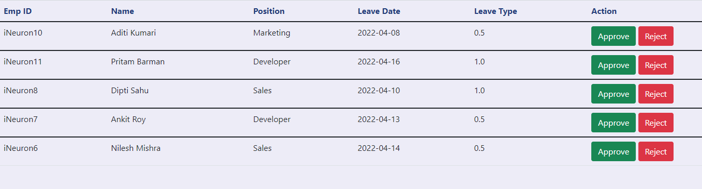

# Leave-Management-System

- With the help of this system admin can add, remove, update employee's information and can approve or reject their leaves
- Employee's can apply for leave, check leave status and claim money 


# Application Link
https://leave-management-application.herokuapp.com/

# Project Demo
https://youtu.be/FXWDncjgy4U

# Documents
dpr:

https://docs.google.com/presentation/d/1EaRgUIhW5HJVqhFlMny18yPMumw2TE-0/edit?usp=sharing&ouid=103378034267053365048&rtpof=true&sd=true

architecure:

https://drive.google.com/file/d/11zXrc99kwBgSx_5zsRLR6zabDFjPUFEs/view?usp=sharing

lld:

https://docs.google.com/document/d/12VB707wAQNUB2OaSdqoap_qAX8QU2l2t/edit?usp=sharing&ouid=103378034267053365048&rtpof=true&sd=true

hld:

https://docs.google.com/document/d/1BulNSWp3LbLBsUPFZT8M0DuFO-kZdeEf/edit?usp=sharing&ouid=103378034267053365048&rtpof=true&sd=true

# Database
Cassandra database has been used to store information of employee and for logging
# :desktop_computer:	 Installation
### :hammer_and_wrench: Requirements
- python 3.x
- Flask
- pandas
- APScheduler
- cassandra-driver
# :gear:	 Setup
1. Install Flask:

```pip install Flask```

2. Install pandas:

```pip install pandas```

3. Install APScheduler:

```pip install APScheduler```

4. Install cassandra-driver

```pip install cassandra-driver```

# Contributor
- Sayan Saha
